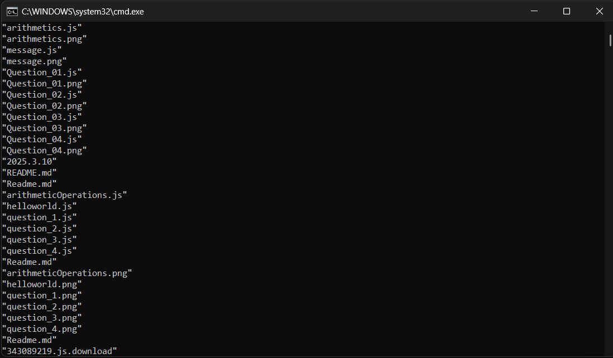
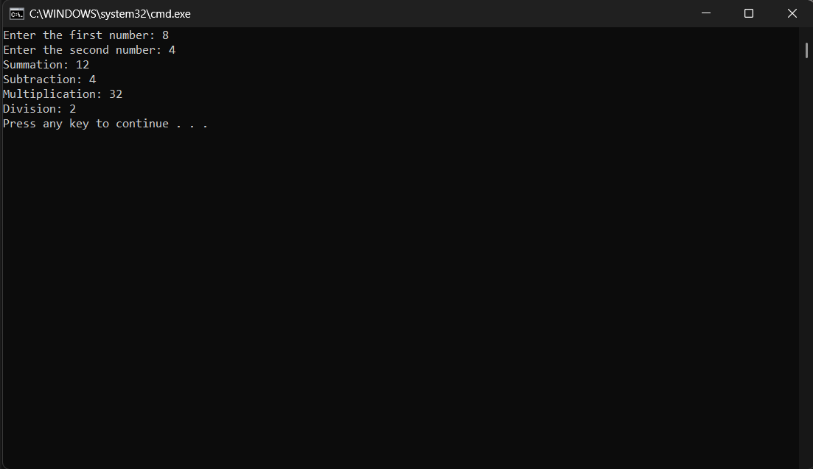
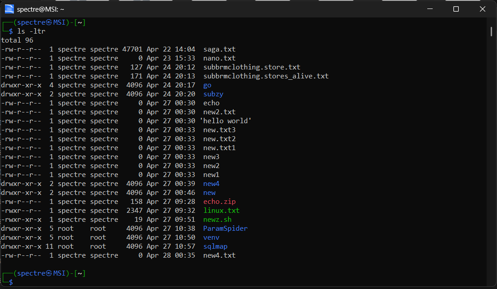
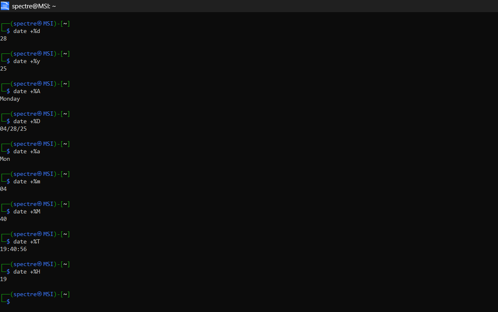
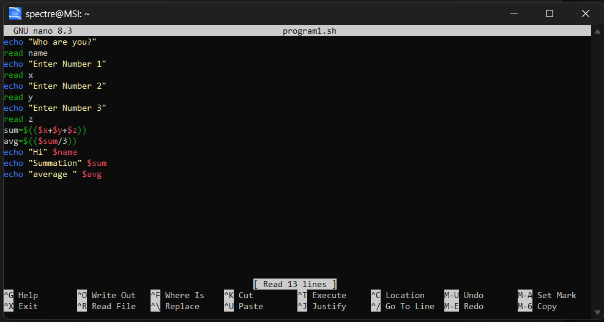
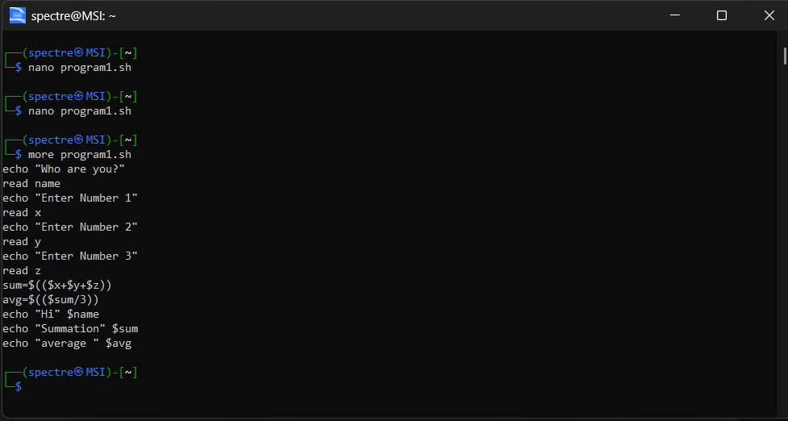
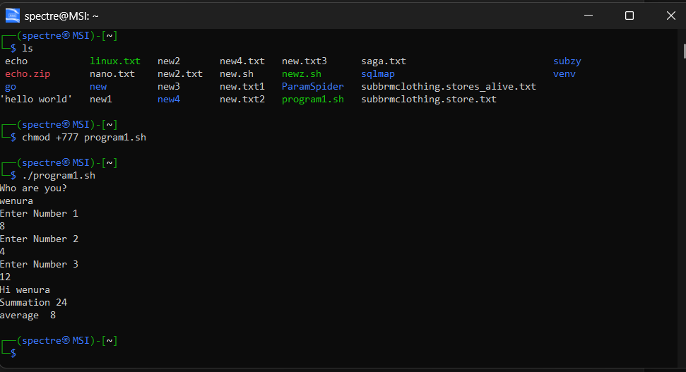

# Operating System Course - Day 03

[](https://learn.microsoft.com/en-us/windows-server/administration/windows-commands/windows-commands)
[](https://www.microsoft.com/windows)
[]()
[]()

> 📚 A comprehensive collection of daily practical lessons for Operating System course focusing on Windows batch scripting.

## 📋 Course Overview

This repository contains practical exercises and implementations for the Operating System course, focusing on Windows batch scripting and shell programming. Each lesson is carefully organized with detailed explanations and visual outputs.

## 🗓️ Day 03 Content

### 🎯 Learning Objectives
- Understanding basic batch script operations
- Implementing counters and control structures
- Working with shell script variables and arithmetic operations
- Practicing user input and output formatting

### 📊 Implementation Structure

| Category | File | Description | Visual Output |
|----------|------|-------------|---------------|
| Counter | `Count.bat` | Counter implementation with loop structures |  |
| Exercise | `Exercise.bat` | Batch script exercise with user interaction |  |
| Shell Script | `program1.sh` | Interactive shell script for calculations |  |
| Additional | `output4.png` | Additional demonstration |  |
| Extended | `output5.png` | Extended example |  |
| Further | `output6.png` | Further implementation |  |
| Final | `output7.png` | Final result |  |

#### 1. Counter Implementation (`Count.bat`)
- Purpose: Demonstrates loop structures and counter variables in batch scripting
- Features:
  - Loop implementation
  - Counter manipulation
  - Output formatting

```batch
@echo off
REM Initialize counter
set /a counter=1

REM Start loop
:loop
if %counter% gtr 10 goto end

REM Display counter
echo Counter: %counter%

REM Increment counter
set /a counter+=1
goto loop

:end
echo Loop completed
pause
```

**Line-by-Line Explanation:**
1. `@echo off` - Disables command echoing
2. `set /a counter=1` - Initializes counter variable
3. `:loop` - Defines loop label
4. `if %counter% gtr 10 goto end` - Checks if counter exceeds 10
5. `echo Counter: %counter%` - Displays current counter value
6. `set /a counter+=1` - Increments counter
7. `goto loop` - Returns to loop start
8. `:end` - Defines end label
9. `pause` - Waits for user input

#### 2. Exercise Implementation (`Exercise.bat`)
- Purpose: Practices batch script fundamentals with user interaction
- Features:
  - User input handling
  - Conditional statements
  - Result display

```batch
@echo off
REM Get user input
set /p name=Enter your name: 
set /p num=Enter a number: 

REM Process input
if %num% gtr 10 (
    echo Number is greater than 10
) else (
    echo Number is less than or equal to 10
)

REM Display personalized message
echo Thank you, %name%!
pause
```

**Line-by-Line Explanation:**
1. `set /p name=Enter your name:` - Prompts for user's name
2. `set /p num=Enter a number:` - Gets numeric input
3. `if %num% gtr 10` - Compares input number
4. `echo Thank you, %name%!` - Shows personalized message

#### 3. Shell Script Implementation (`program1.sh`)
- Purpose: Demonstrates arithmetic operations in shell scripting
- Features:
  - User input processing
  - Arithmetic calculations
  - Formatted output

```bash
#!/bin/bash
# Ask for user's name
echo "Who are you?"
read name

# Get three numbers
echo "Enter Number 1"
read x
echo "Enter Number 2"
read y
echo "Enter Number 3"
read z

# Calculate sum and average
sum=$(($x + $y + $z))
avg=$(($sum / 3))

# Display results
echo "Hi" $name
echo "Summation" $sum
echo "average " $avg
```

**Script Breakdown:**
- User Input:
  - Collects user's name
  - Gathers three numbers for calculation
- Calculations:
  - Computes sum of three numbers
  - Calculates average
- Output:
  - Personalizes greeting with user's name
  - Displays calculation results

### 📝 Script Implementations

#### 1. Arithmetic Operations Implementation (`arithmetics.js`)
```javascript
// This program demonstrates basic arithmetic operations
const readline = require('readline').createInterface({
    input: process.stdin,
    output: process.stdout
});

// Prompt for first number
readline.question('Enter the first number: ', (num1) => {
    // Prompt for second number
    readline.question('Enter the second number: ', (num2) => {
        // Convert string inputs to numbers
        num1 = parseFloat(num1);
        num2 = parseFloat(num2);
        
        // Perform arithmetic operations
        console.log('Summation:', num1 + num2);       // Addition
        console.log('Subtraction:', num1 - num2);     // Subtraction
        console.log('Multiplication:', num1 * num2);  // Multiplication
        console.log('Division:', num1 / num2);        // Division
        
        readline.close();
    });
});
```

**Code Explanation:**
1. **Module Import and Setup:**
   - Imports the readline module for handling user input
   - Creates an interface for input/output operations

2. **User Input Handling:**
   - Uses readline.question() to prompt for numbers
   - Implements nested callbacks for sequential input

3. **Data Processing:**
   - Converts string inputs to numbers using parseFloat()
   - Performs all arithmetic operations in sequence

4. **Output Display:**
   - Shows results of all operations
   - Formats output with descriptive labels

#### 2. Shell Script Date Commands (`date_commands.sh`)
```bash
# Display various date formats
date +%d    # Outputs: 28 (current day of month)
date +%y    # Outputs: 25 (current year in YY format)
date +%A    # Outputs: Monday (full weekday name)
date +%D    # Outputs: 04/28/25 (date in MM/DD/YY)
date +%a    # Outputs: Mon (abbreviated weekday)
date +%m    # Outputs: 04 (current month)
date +%M    # Outputs: 40 (current minute)
date +%T    # Outputs: 19:40:56 (time in HH:MM:SS)
date +%H    # Outputs: 19 (current hour in 24h format)
```

**Command Breakdown:**
1. **Date Components:**
   - %d: Extracts day of month (01-31)
   - %y: Shows year in two-digit format
   - %A/%a: Displays weekday name (full/abbreviated)

2. **Time Components:**
   - %H: Hour in 24-hour format
   - %M: Minutes (00-59)
   - %T: Full time stamp

3. **Combined Formats:**
   - %D: American date format (MM/DD/YY)
   - Custom combinations possible using multiple format specifiers

#### 3. Interactive Calculator (`program1.sh`)
```sh
# Ask the user for their name
echo "Who are you?"
read name

# Ask the user for three numbers
echo "Enter Number 1"
read x
echo "Enter Number 2"
read y
echo "Enter Number 3"
read z

# Calculate the sum and average
sum=$(($x + $y + $z))    # Arithmetic expansion for sum
avg=$(($sum / 3))        # Integer division for average

# Display personalized results
echo "Hi" $name          # Greet user
echo "Summation" $sum    # Show total
echo "average " $avg     # Display average
```

**Script Analysis:**
1. **Input Section:**
   - Uses echo for user prompts
   - read command captures user input
   - Stores values in shell variables

2. **Calculation Logic:**
   - $((...)) performs arithmetic expansion
   - Handles basic arithmetic operations
   - Implements integer division

3. **Output Formatting:**
   - Combines strings with variables
   - Provides clear, labeled results
   - Maintains user-friendly interface

### 🔍 Technical Notes

#### Batch Script Guidelines
- Use consistent naming conventions
- Include error handling where appropriate
- Follow Windows command syntax
- Maintain clear code structure

#### Shell Script Best Practices
- Proper variable naming
- Clear arithmetic operations
- User-friendly prompts
- Organized output format

### 📁 Additional Resources

#### Visual References

##### 1. Arithmetic Operations Output


This output demonstrates the execution of our arithmetic operations program:
- Takes two numbers as input (8 and 4)
- Performs four basic operations:
  - Summation: 8 + 4 = 12
  - Subtraction: 8 - 4 = 4
  - Multiplication: 8 * 4 = 32
  - Division: 8 / 4 = 2

##### 2. Date Command Examples


Shows various date command outputs:
- Day format (%d): 28
- Year format (%y): 25
- Full weekday (%A): Monday
- Date format (%D): 04/28/25
- Abbreviated weekday (%a): Mon
- Month (%m): 04
- Minute (%M): 40
- Time (%T): 19:40:56
- Hour (%H): 19

##### 3. Shell Script Calculator


Displays the interactive shell calculator in action:
- Prompts for user input
- Performs calculations
- Shows formatted output with:
  - User greeting
  - Sum calculation
  - Average computation

#### Useful Commands

```bash
# Date Commands
date +%d    # Day of month (01-31)
date +%y    # Year (00-99)
date +%A    # Full weekday name
date +%D    # Date as mm/dd/yy
date +%a    # Abbreviated weekday
date +%m    # Month (01-12)
date +%M    # Minute (00-59)
date +%T    # Time as HH:MM:SS
date +%H    # Hour (00-23)

# File Operations
touch new.sh     # Create new file
more new.sh      # View file content
nano new.sh      # Edit in nano
ls               # List files
./new.sh         # Execute script


```batch
:: Windows Commands
echo %date%      :: Display current date
set /a counter=1 :: Initialize variable
time /t         :: Display current time

:: Batch File Operations
type file.txt   :: View file content
copy source dest :: Copy files
del file.txt    :: Delete file
mkdir newdir    :: Create directory

:: Script Execution
call script.bat :: Run batch script
pause          :: Wait for user input
```

---

<div align="center">

📖 **Learning Path** | 🛠️ **Practical Examples** | 📊 **Visual Outputs**

</div>
